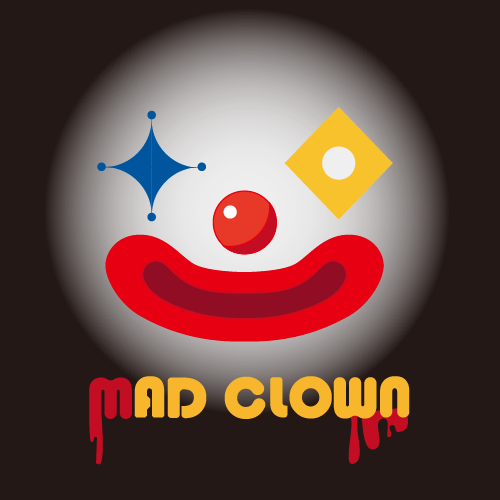
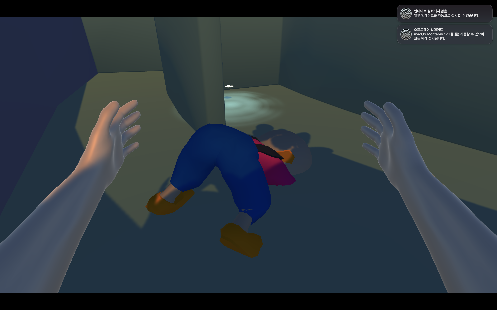
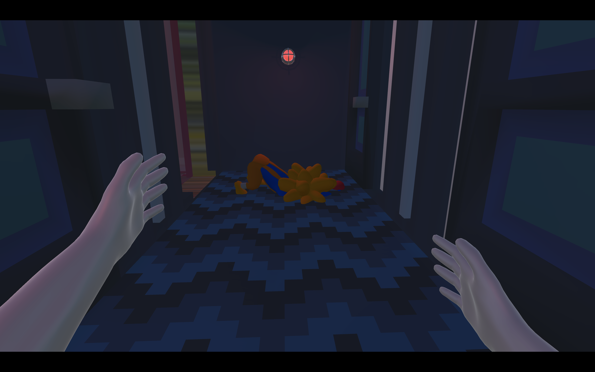

# Mad Clown

## Summary

2021 Winter [CS496] KAIST 몰입캠프 Project #3



```Mad Clown```은 햄버거 가게 ```MadDonald```에서 광대로부터 햄버거를 훔쳐 달아나는 게임입니다.

## Play


1층, 2층의 미로를 탐험하며 햄버거 재료를 모으자


각각의 재료는 문의 열쇠가 될 수도,


잠들어있던 광대를 깨우는 트리거가 될 수도





가짜 재료일 수도 있다


광대는 플레이어를 계속해서 쫓아 옵니다


광대를 피해 2층 미로 중앙의 엘리베이터를 타고 탈출하세요


엘리베이터를 타면 식탁이 있는 층으로 갈 수 있습니다.


햄버거를 모두 모아서 탈출하고 맛있게 햄버거를 먹어봐요~


## Implementation

C#, Unity, Blender 3D modeling

Nav Mesh를 이용한 플레이어 추적

## Made by

[KAIST 강현희](https://github.com/presenthee)

[KAIST 노민우](https://github.com/ayofine12)

[고려대학교 노정훈](https://github.com/overthestream)